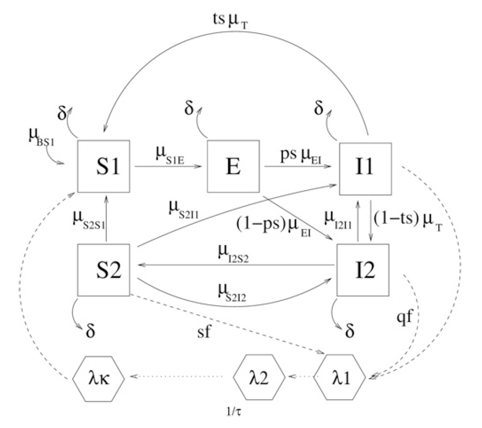

# Dynamic Malaria Transmission Model

###### Dynamical malaria models reveal how immunity buffers effect of climate variability
**DOI** : 10.1073/pnas.1419047112

We classify humans into five distinct classes:
+ **S1**, susceptible to infection;
+ **E**, exposed (i.e., carrying a latent infection but not yet infectious);
+ **I1**, infected symptomatic and infectious;
+ **I2**, infected asymptomatic and infectious;
+ and **S2**, recovered but with a subpatent load of parasites (not completely cleared) and potentially infectious to mosquitoes;

> **Fig. 2.** Flow diagram of the ``SDE`` model. Human classes are S1 (susceptible), E (exposed, carrying a latent infection), I1 (symptomatic infected and infectious), I2 (asymptomatic infected and infectious), and S2 (recovered subpatent, i.e., having some resistance to reinfection). Mosquito–parasite classes are λ1 (force of infection at previous time t − s) and λκ (force of infection at current time t). The possibility of transition between classes X and Y is denoted by a solid arrow, with the corresponding rate written as μXY. The dotted arrows represent interactions between the human and mosquito stages of the parasite. The model is formalized by ``Eqs. S1–S5`` and ``Eqs. S9–S11``.