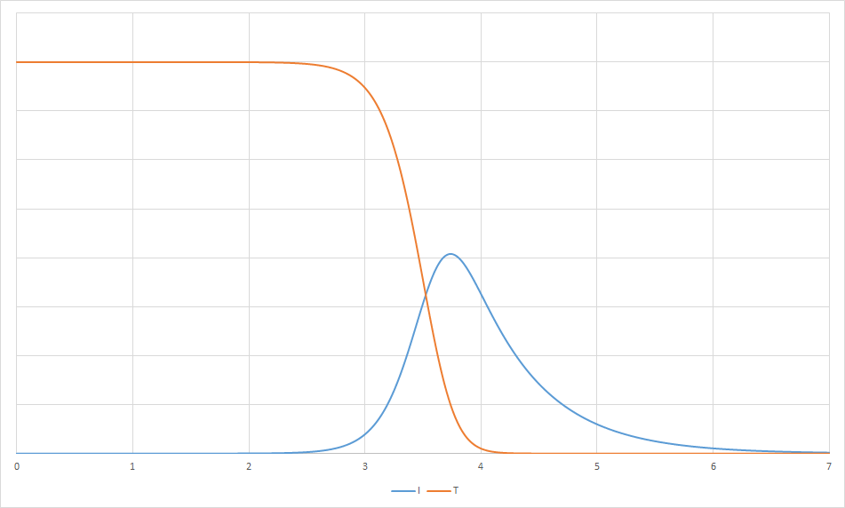
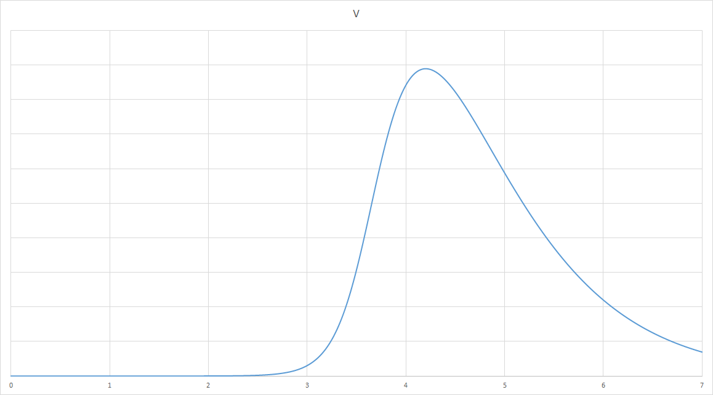

## Kinetics of influenza A virus infection in humans

> **DOI:** 10.3390/v7102875

###### ODEs Model

```vbnet
Imports Microsoft.VisualBasic.Mathematical.BasicR
Imports Microsoft.VisualBasic.Mathematical.diffEq

Public Class Kinetics_of_influenza_A_virus_infection_in_humans : Inherits ODEs

    Dim T As var
    Dim I As var
    Dim V As var

    Const p = 3 * 10 ^ -2
    Const c = 2
    Const beta = 8.8 * 10 ^ -6
    Const delta = 2.6

    Protected Overrides Sub func(dx As Double, ByRef dy As Vector)
        dy(T) = -beta * T * V
        dy(I) = beta * T * V - delta * I
        dy(V) = p * I - c * V
    End Sub

    Protected Overrides Function y0() As var()
        Return {
            V = 1.4 * 10 ^ -2,
            T = 4 * 10 ^ 8,
            I = 0
        }
    End Function
End Class
```

Not sure why this R model not working:

```R
require(deSolve)

p     <- 3e-2
cc    <- 2
beta  <- 8.8e-6
delta <- 2.6

yini  <- c(V=1.4e-2, T=4e8, I=0)

model <- function(t,y,params) {
	with(as.list(y), {

		dT <- -beta*T*V
		dI <-  beta*T*V-delta*I
		dV <-     p*I     -cc*V

		list(c(dT,dI,dV))
	})
}

times <- seq(from=0,to=7,by=0.001)
out   <- ode(y=yini,times=times,func=model,parms=NULL)

write.csv(out, "./Kinetics_of_influenza_A_virus_infection_in_humans.R.csv")
plot(out)
```

##### Result

###### Susceptible & Infected Cells


###### Virus

