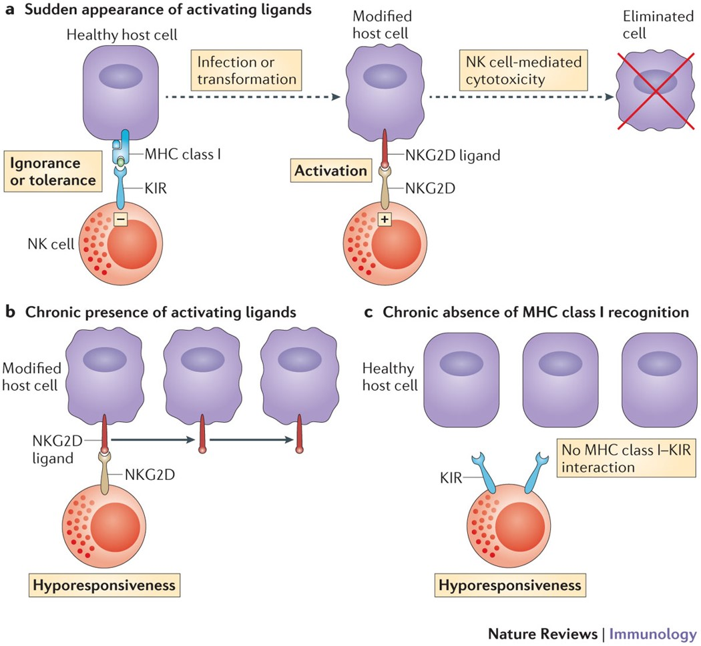

###### Figure 1: Natural killer cell tuning.

+ **a |** Natural killer (NK) cells can distinguish their targets (that is, infected or transformed host cells) from healthy host cells on the basis of the engagement of activating receptors (such as natural killer group 2 member D (NKG2D); shown by the plus sign) and the lack of engagement of killer inhibitory receptors (KIRs; shown by the minus sign). In this example, the recognition of MHC class I molecules on healthy cells by the inhibitory KIRs expressed on human NK cells induces a dominant inhibitory signal in NK cells. By contrast, host cells can be modified as a result of various assaults, such as tumour transformation or microbial infection. In these circumstances, molecules induced or upregulated at the surface of the target cell, engage activating receptors, such as NKG2D, which leads to NK cell activation and eventually to the elimination of the target cells.
+ **b |** Although NK cells are activated by modified cells expressing ligands for activating receptors, the chronic presence of activating ligands reprogrammes NK cells to become hyporesponsive.
+ **c |** The absence of MHC class I expression on target cells releases NK cells from the inhibition induced by KIRs, but NK cells adapt to the long-lasting absence of MHC class I recognition. When MHC class I or KIR molecules are not present, or when MHC class I and KIR molecules do not interact, NK cells adapt to this environment by increasing their threshold of reactivity, which leads to NK cell hyporesponsiveness.

> The speed of change: towards a discontinuity theory of immunity? ``doi:10.1038/nri3521``