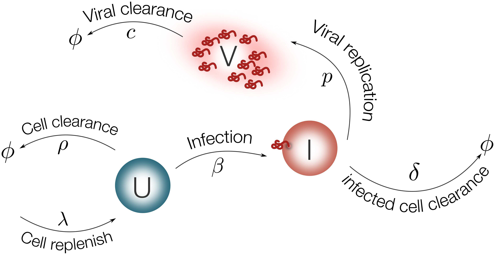

# In Vivo Systems Models Summary
The first mathematical model to describe IAV dynamics was developed in 1976 by Larson et al.. The model was fitted to viral titer data of mice infected with ``IAV (H3N2)``. After thirty years without modeling efforts, a work that described
the IAV infection dynamics was presented by Baccam et al., which adopted the well-known **target cell model**.


**Figure 2. Target cell model.**

+ (**Left**) IAV (``V``) infects susceptible cells (``U``) with rate ``β``. Infected cells are cleared with rate ``δ``. Once cells are productively infected (``I``), they release virus at rate ``p`` and virus particles are cleared at rate ``c``. The symbol ``Φ`` represents clearance;
+ (Right) Computational simulations of the target cell model. Parameter values used for model simulation are taken from [26]. The susceptible cells (red line) are rapidly infected while the virus (black line) and infected cells (blue line) peak at day one approximately. The viral growth is limited by the number of susceptible cells, decreasing the viral load and the number of infected cells to undetectable levels.

###### Target Cell Model
```
U' = -βUV
I' =  βUV - δI
V' =  pI  - cV
```

Several mathematical works have tried to model the eclipse phase _in vivo_ and _in vitro_. These models have aimed at representing the time frame of the infection more adequately. This has resulted in an additional state, in which newly infected cells rest in a latent phase before becoming productively infected cells (``I``). Thus, the model with the eclipse phase can be represented as follows:

```
U' = -βUV
E' =  βUV - kE'
I' =  kE' - δI
V' =  pI  - cV
```

where ``E'`` represents the cells in the eclipse phase, which can become productively infected at rate ``k``.

**[26]** _Baccam, P.; Beauchemin, C.A.A.; Macken, C.A.A.; Hayden, F.G.; Perelson, A.S._ **Kinetics of influenza A virus infection in humans**. J. Virol. 2006, 80, 7590–7599.

> "Modeling Influenza Virus Infection: A Roadmap for Influenza Research". Viruses 2015, 7, 5274-5304; ``doi:10.3390/v7102875``

## 1. Kinetics of influenza A virus infection in humans

+ **DOI: ** doi:10.3390/v7102875

###### Abstract
Currently, little is known about the viral kinetics of influenza A during infection within an individual. We utilize a series of mathematical models of increasing complexity, which incorporate target cell limitation and the innate interferon response, to examine influenza A virus kinetics in the upper respiratory tracts of experimentally infected adults. The models were fit to data from an experimental H1N1 influenza A/Hong Kong/123/77 infection and suggest that it is important to include the eclipse phase of the viral life cycle in viral dynamic models. Doing so, we estimate that after a delay of ~6 h, infected cells begin producing influenza virus and continue to do so for ~5 h. The average lifetime of infected cells is ~11 h, and the half-life of free infectious virus is ~3 h. We calculated the basic reproductive number, R0, which indicated that a single infected cell could produce ~22 new productive infections. This suggests that antiviral treatments have a large hurdle to overcome in moderating symptoms and limiting infectiousness and that treatment has to be initiated as early as possible. For about 50% of patients, the curve of viral titer versus time has two peaks. This bimodal behavior can be explained by incorporating the antiviral effects of interferon into the model. Our model also compared well to an additional data set on viral titer after experimental infection and treatment with the neuraminidase inhibitor zanamivir, which suggests that such models may prove useful in estimating the efficacies of different antiviral therapies for influenza A infection.

#### A target cell-limited model

In the simplest model, influenza A virus infection is limited by the availability of susceptible target (epithelial) cells rather than the effects of the immune response. A model of acute viral infection that incorporates target cell limitation can be described by the following differential equations:

```
dT/dt = -βTV
dI/dt =  βTV - δI
dV/dt =  pI  - cV
```
where T is the number of uninfected target cells, I is the number of productively infected cells, and V is the infectiousviral titer expressed in TCID50/ml of nasal wash. We assume that infection is initiated by the introduction of virus into the upper respiratory tract at a concentration equivalent to V0 TCID50/ml of nasal wash. Susceptible cells become infected by virus at rate TV, where  is the rate constant characterizing infection.
Virally infected cells, I, by shedding virus increase viral titers at an average rate of p per cell and die at a rate of  per cell, where 1/ is the average life span of a productively infected cell. Free virus is cleared at a rate of c per day. The effects of immune responses are not explicitly described in this simple model, but they are implicitly included in the death rate of infected cells () and the clearance rate of virus (c). The reduction in viral titer due to binding and infection of target cells at rate TV makes little impact on the amount of free virus and was neglected. The mechanism of virion clearance is unknown and may involve mucociliary clearance as well as binding of virions to cells and to respiratory secretions, such as mucins.

#### Parameters

###### TABLE 2. Patient-specific best-fit parameter values for the target cell-limited model with no delay
|Patient|V<sub>0</sub><br/>(TCID<sub>50</sub>/ml)         |β<br/>[(TCID<sub>50</sub>/ml)<sup>-1</sup><br/> x d<sup>-1</sup>]|p<br/>(TCID<sub>50</sub>/ml x d<sup>-1</sup>)    |c<br/>(d<sup>-1</sup>)|t<sub>1/2</sub> (h)|δ<br/>(d<sup>-1</sup>)|1/δ (h) |R<sub>0</sub>|SSR<br/>(TCID<sub>50</sub>/ml)<sup>2</sup>|
|-------|---------------------------------------------|--------------------------------------------------------|---------------------------------------------|------------------|--------------------|------------------|--------|-------------|--------------------------------------|
|1      |3.5 x 10<sup>-1</sup>                        |3.4 x 10<sup>-5</sup>                                   |7.9 x 10<sup>-3</sup>                        |3.3               | 5.0                | 3.4              | 7.1    | 9.6         | 4.6                                  |
|2      |1.4 x 10<sup>-3</sup>                        |1.6 x 10<sup>-4</sup>                                   |4.1 x 10<sup>-3</sup>                        |2.1               | 7.7                | 11.2             | 2.1    | 11.2        | 7.0                                  |
|3      |1.0 x 10<sup>-2</sup>                        |1.3 x 10<sup>-4</sup>                                   |3.2 x 10<sup>-3</sup>                        |2.1               | 7.9                | 2.1              | 11.4   | 37.7        | 8.3                                  |
|4      |9.1 x 10<sup>-1</sup>                        |6.3 x 10<sup>-6</sup>                                   |4.2 x 10<sup>-2</sup>                        |3.1               | 5.4                | 2.8              | 8.7    | 12.4        | 4.0                                  |
|5      |4.3 x 10<sup>-1</sup>                        |2.3 x 10<sup>-5</sup>                                   |1.0 x 10<sup>-2</sup>                        |4.2               | 4.0                | 5.1              | 4.7    | 4.4         | 9.0                                  |
|6      |3.3 x 10<sup>-1</sup>                        |3.8 x 10<sup>-6</sup>                                   |7.1 x 10<sup>-2</sup>                        |3.6               | 4.6                | 3.6              | 6.7    | 8.3         | 13.6                                 |
|Avg    |9.3 x 10<sup>-2</sup>                        |2.7 x 10<sup>-5</sup>                                   |1.2 x 10<sup>-2</sup>                        |3.0               | 5.6                | 4.0              | 6.0    | 11.1        | 7.1                                  |
|95% CI |1.4 x 10<sup>-2</sup><br/>– 6.1 x 10<sup>-1</sup>|8.8 x 10<sup>-6</sup> <br/>– 8.3 x 10<sup>-5</sup>           |4.8 x 10<sup>-3</sup> <br/>– 3.0 x 10<sup>-2</sup>|2.4 – 3.6         | 4.6–6.9            | 2.6–6.1          | 3.9–9.2| 6.6–18.5    | 5.1–9.9                              |

+ a. For each patient, the best-fit initial virus titer (V0), infection rate constant (), average rate of increase of viral titer per infected cell (p), viral clearance rate (c),
half-life of free virus (t1/2), infected-cell lifespan (1/), basic reproductive number (R0), and sum of square residuals (SSR) are given along with their geometric average
and geometric 95% CI. The parameter T0 was held fixed at a value of 4  108 cells.

## 2. Ebola virus infection modeling and identifiability problems

+ **DOI** [10.3389/fmicb.2015.00257](https://www.doi.org/10.3389/fmicb.2015.00257)
+ **ISSN** 1664-302X

###### ABSTRACT
The recent outbreaks of Ebola virus (EBOV) infections have underlined the impact of the virus as a major threat for human health. Due to the high biosafety classification of EBOV (level 4), basic research is very limited. Therefore, the development of new avenues of thinking to advance quantitative comprehension of the virus and its interaction with the host cells is urgently needed to tackle this lethal disease.

Mathematical modelling of the EBOV dynamics can be instrumental to interpret Ebola infection kinetics on quantitative grounds. To the best of our knowledge, a mathematical modelling approach to unravel the interaction between EBOV and the host cells is still missing. In this paper, a mathematical model based on differential equations is used to represent the basic interactions between EBOV and wild-type Vero cells in vitro. Parameter sets that represent infectivity of pathogens are estimated for EBOV infection and compared with influenza virus infection kinetics. The average infecting time of wild-type Vero cells in EBOV is slower than in influenza infection. Simulation results suggest that the slow infecting time of EBOV could be compensated by its efficient replication. This study reveals several identifiability problems and what kind of experiments are necessary to advance the quantification of EBOV infection. A first mathematical approach of EBOV dynamics and the estimation of standard parameters in viral infections kinetics is the key contribution of this work, paving the way for future modelling work on EBOV infection.


> **FIGURE1 | Ebola virus molecular structure.** The Ebola genomeis composed of 3 leader, nucleoprotein(NP), virion protein 35(VP35),VP40,glycoprotein(GP),VP30,VP24,polymerase(L) protein and 5 trailer(adapted from SIB SWISS Institute of Bioinformatics,2014).


> **Figure 2. Schematic representation of the model for EBOV infection.** Target cells (U) are replenished with rate λ and die with rate ρ. Virus (V) infects target cells (U) with rate β. Infected cells are cleared with rate δ. Once cells are productively infected (I), they release virus at rate p and virus particles are cleared with rate c.

The EBOV infection model is considered as follows:

```vbnet
dU/dt = λ − ρU − βUV    (1)
dI/dt =     βUV − δI    (2)
dV/dt =     pI − cV     (3)
```

###### Parameters

+ The parameter ``ρ`` is fixed from literature as 0.001day<sup>−1</sup> (Moehleretal.,2005). The effect of fixing this value on the model output is evaluated with a sensitivity analysis.
+ **λ = U<sub>0</sub>ρ**
+ There is experimental evidence that the half-life of epithelium cells in lung is 17–18 months in average(Rawlins and Hogan,2008). In view of this, the infected cell death rate(δ) is fixed at 10<sup>−3</sup>.
+ **TABLE 1 | Bootstrap estimates of infection parameters<sup>*</sup>.**

|Parameters (units)|Best fit<sup>**</sup>                       |Bootstrap estimates|2.5% quantile|Median|97.5% quantile|
|------------------|------------------------------------------------------|---------|-------------|------|--------------|
|β                 |[day<sup>−1</sup>(ffu/ml)<sup>−1</sup>10<sup>−7</sup>]|1.91     |1.78         |4.06  |261.95        |
|p                 |(ffu/ml day<sup>−1</sup>cell<sup>−1</sup>)            |378      |31.80        |62.91 |580.69        |
|c                 |(day<sup>−1</sup>)                                    |8.02     |0.18         |1.05  |18.76         |
|t<sub>inf</sub>   |(hours)                                               |5.64     |1.68         |9.49  |10.7          |

\*Note that these parameter should be interpreted with the discussed identifiability problems.<br/>
\*\*Values obtained from optimization procedure to the low MOI viral titer presentedin Halfmann et al. (2008).

###### Initial Value

+ The initial number of susceptible cells(**U<sub>0</sub>**) can be taken from the experiment in Halfmann et al. (2008) as 5 × 10<sup>5</sup>.
+ The initial value for infected cells(**I<sub>0</sub>**) is set to zero. The viral titer in Halfmann et al.(2008) is measured in foci forming units per milliliter(ffu/ml).
+ The initial viral load(**V<sub>0</sub>**) is estimated from the data using the fractional polynomial model of second order(Royston and Altman, 1994). The best model based on the *Akaike Information Criterion(``AIC``)* is presented in Figure3,  providing an estimate of 9 ffu/ml for **V<sub>0</sub>**.

## 3. Identifiability Challenges in Mathematical Models of Viral Infectious Diseases

+ **ISSN** 2405-8963
+ **DOI** [10.1016/j.ifacol.2015.12.135](http://dx.doi.org/10.1016/j.ifacol.2015.12.135)

###### Abstract
Nowadays, infections by viral pathogens are one of the biggest health threats to mankind. The development of new avenues of thinking to integrate the complexity of infectious diseases and the immune system is urgently needed. Recently mathematical modelling has emerged as a tool to interpret experimental results on quantitative grounds providing relevant insights to understand several infectious diseases. Nevertheless, modelling the complex mechanisms between viruses and the immune system can result in models with a large number of parameters to be estimated. Furthermore, experimental measurements have the problem to be sparse (in time) and highly noisy. Therefore, structural and practical identifiability are key obstacles to overcome towards mathematical models with predictive value. This paper addresses the identifiability limitations in the most common mathematical model to represent viral infections. Additionally, numerical simulations reveal how initial conditions of differential equations and fixing parameter values can alter the profile likelihood.

**Keywords:** parameter estimation; identifiability; viral infections


> **Fig. 1. Viral infection model.** Host cells can be either susceptible(``U``) or infected (``I``). Virus (``V``) infects susceptible cells with constant rate. Once cells are infected, they release virus at rate p and virus particles are cleared with rate ``c``. Infected cells can die with rate either by cytopathic viral effects or by the immune response.
>
```
U' =    - UV     (1)
I' = UV − I      (2)
V' = pI − cV     (3)
```

###### Parameters


> **Fig.2. Best parameter fitting.** Cell dynamics are shown in panel(a). Viral titer data from Toapanta and Ross[2009] and simulation results are shown in panel(b). Best fitting values are β=7.22×10<sup>−7</sup>, p=9.95, c=7.12 and δ=3.07. Experiments showed that the viral titer was not detectable at day 9 for 6 mice(detection levels,less than 50 PFU/ml, are shown with a horizontal dashed line in panel(b)).

###### Initial Value
+ For initial conditions in our biological problem, the estimated number of epithelial cells(**U<sub>0</sub>**) can be experimentally fixed, which is considered as 10<sup>7</sup> cells reported by Toapanta and Ross[2009].
+ Initial values for infected cells(**I<sub>0</sub>**) are taken as zero.
+ The initial viral titre **V<sub>0</sub>** in the majority of the works is constrained to be below the detection limit(less than 50 ffu/ml). Previous modelling works suggests using half of the detection limits or less[Thi´ebautetal.,2006].