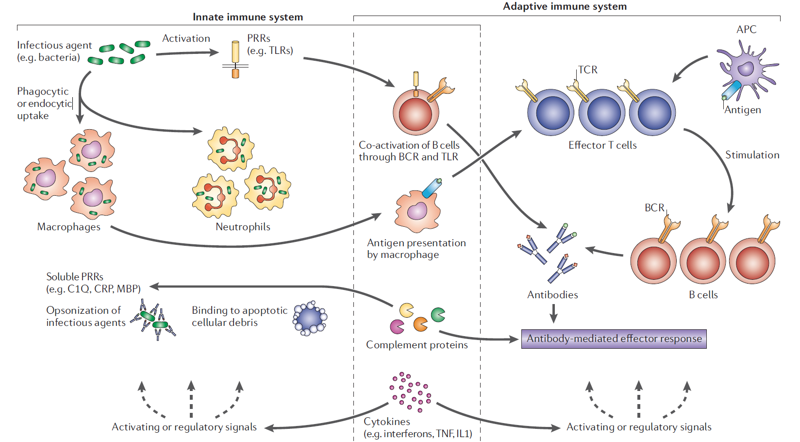

Figure 1 | **The innate and adaptive immune systems and the overlap between them.** Innate immune mechanisms generally involve immediate, nonspecific responses to foreign infectious agents. These include cellular functions such as phagocytosis and endocytosis by macrophages and neutrophils. Some of these activities are dependent on pattern-recognition receptors (PRRs), such as Toll-like receptors (TLRs) and NOD-like receptors, which recognize pathogen-associated molecular patterns (PAMPs) present on a variety of microorganisms. In addition, a variety of soluble PRRs, such as complement proteins (C1Q), mannose-binding protein (MBP), and acute phase reactants, such as C-reactive protein (CRP), have a role in innate immunity by opsonizing microroganisms and binding to apoptotic cellular debris in a nonspecific manner. Adaptive immune mechanisms involve the engagement of receptors that are selected for reactivity with specific antigens (T-cell receptors (TCRs) and immunoglobulin receptors on B cells). The full development of these responses requires the expansion and differentiation of the specific responder cells, which establishes a memory for the specific antigen response. The innate and adaptive immune systems are interrelated in ways that have not been fully established. For example, antigens that are phagocytosed or endocytosed in a nonspecific manner by macrophages are presented to T cells, generating a highly specific T-cell response. In addition, co-stimulation of B cells through TLRs (such as TLR9) can result in the production of specific antibodies to self antigens. Cytokines such as interferons, tumour necrosis factor (TNF), and interleukin 1 (IL1) might stimulate activity of both the innate and adaptive immune response. Complement proteins also mediate the effector responses induced by antibodies (not shown), and therefore have a role in both innate and adaptive immune functions. APC, antigen-presenting cell; BCR, B-cell receptor.

> Genetics of autoimmune diseases — disorders of immune homeostasis. DOI: ``10.1038/nrg1944``